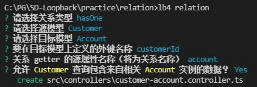

# Loopback4 Relation Demo

**该文档仅做简单介绍，详细请参考[官方文档](https://loopback.io/doc/en/lb4/Relations.html)**

该文档将**主要讲解hasMany关系**，belongsTo/hasOne除提及外基本和hasMany差别不大

- **Guide**
  - **[Prepare](#Prepare)**
  - **[hasMany](#hasMany)**
  - **[belongsTo](#belongsTo)**
  - **[hasOne](#hasOne)**

## Prepare {#Prepare}

- 请先创建db，然后执行 [demo_lb4_relation.sql](./resource/demo_lb4_relation.sql) 文件内容即可。
- 创建lb4 app
- 创建DataSource
- 创建DB table对应的model、repository

## hasMany {#hasMany}

即 源model与目标model一对多的关系

**[对应官方文档](https://loopback.io/doc/en/lb4/HasMany-relation.html)**

创建该关系有如下**便利**

- 通过源model的id对目标model做**CRUD**
- 查询源model时可包含对应目标model资料并可做filter

运行命令 `lb4 relation`，创建customer与order的**一对多**的关系，如下图

根据截图可见，命令会自动生成customer与order的**一对多**的关系对应的**controller**。
controller包含4个api，各api调用的正是分别对应**HasManyRepository**下的CRUD的方法(create/find/patch/delete)，作用是对原model下特定id对应的目标model的CRUD
运行命令导致model和repository的改动可通过git log观察，详细解释请看官方文档

另外，源model对应repository的find方法中的参数filter中的include属性可以利用起来，**[点击查看例子](.\src\services\customer.service.ts)**

## belongsTo {#belongsTo}

即 源model与目标model多对一的关系

创建该关系有如下**便利**

- 通过源model的id对目标model做**查询**
- 查询源model时可包含对应目标model资料并可做filter

运行命令截图如下

## hasOne {#hasOne}

即 源model与目标model一对一的关系

创建该关系有如下**便利**

- 通过源model的id对目标model做**CRUD**
- 查询源model时可包含对应目标model资料并可做filter

运行命令截图如下

